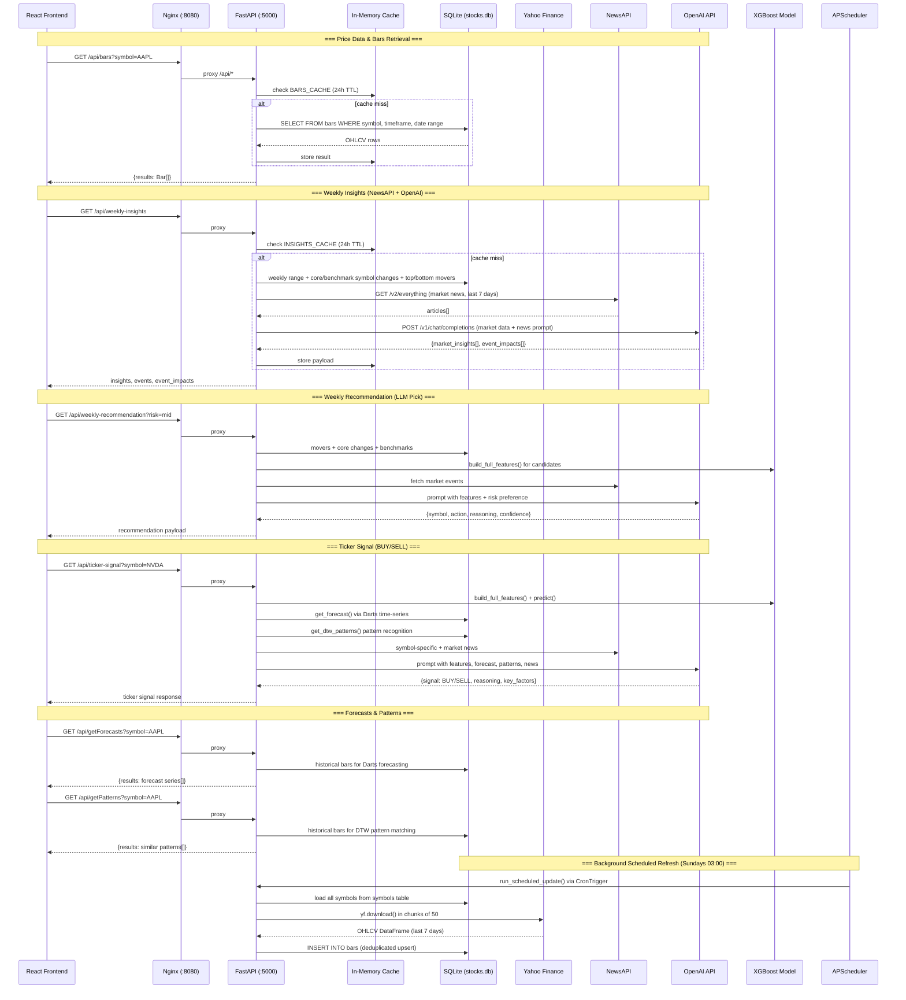

# Data Flow

Overview of how data flows through the AI Stock Trading Platform, covering user-initiated requests (React -> Nginx -> FastAPI -> SQLite/External APIs) and the background scheduled refresh pipeline.

## Key Flows

- **Price Data (Bars)**: Frontend calls `/api/bars`, FastAPI checks a 24-hour in-memory cache keyed by `symbol:timeframe:start:end:order:limit`, then queries the `bars` table in SQLite on cache miss. Used by `StockHistoryService` and `fetchBars()`.

- **Weekly Insights**: `/api/weekly-insights` gathers core symbol changes (NVDA, AAPL, MSFT, etc.), benchmark changes (SPY, QQQ, DIA, IWM), top/bottom weekly movers from SQLite, fetches news articles from NewsAPI `/v2/everything`, then sends all data as a structured JSON prompt to OpenAI `gpt-4o-mini` for market insight bullets and event impact analysis. Results are cached for 24 hours with rate-limit cooldown logic.

- **Weekly Recommendation**: `/api/weekly-recommendation` extends the insights pipeline by also calling `build_full_features()` from the XGBoost module to gather quantitative feature snapshots (momentum, volatility, beta, alpha) for candidate stocks, then asks OpenAI to pick ONE stock given a risk preference (low/mid/high).

- **Ticker Signal (BUY/SELL)**: `/api/ticker-signal` is the most data-intensive endpoint -- it aggregates XGBoost features + predictions, Darts time-series forecasts, DTW pattern matches, market news, and symbol-specific news from NewsAPI, then sends everything to OpenAI for a BUY/SELL decision with reasoning and key factors.

- **Forecasts**: `/api/getForecasts` calls `forecasting.get_forecast()` which uses the Darts library to produce time-series forecasts from historical bar data in SQLite.

- **Pattern Matching**: `/api/getPatterns` calls `pattern_recognition.get_dtw_patterns()` which uses Dynamic Time Warping on historical bars to find similar price patterns.

- **Ticker Conditions**: `/api/getCurrentTickerConditions` builds full XGBoost features for a symbol and runs the trained model to produce a prediction, cached for 24 hours.

- **Background Refresh**: APScheduler runs `run_scheduled_update()` every Sunday at 03:00 (configurable timezone). It loads all symbols from the `symbols` table, downloads the last 7 days of data from Yahoo Finance via `yf.download()` in chunks of 50 tickers, and inserts new rows into `bars` with deduplication. Scheduler state is persisted in the `app_settings` table.

---
*Generated on 2026-03-26*
