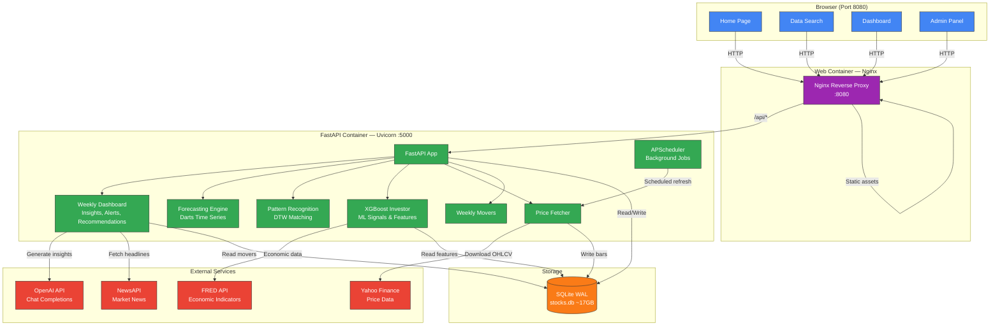

# System Architecture

Overview of the AI Stock Trading Platform showing how the frontend, backend, database, and external services connect.

## Key Components

- **Nginx Reverse Proxy**: Serves the React SPA and forwards `/api/*` requests to FastAPI
- **FastAPI App**: Central API layer with 20+ endpoints for price data, forecasts, patterns, and insights
- **Weekly Dashboard**: Generates LLM-powered market summaries, alerts, and purchase recommendations via OpenAI
- **Forecasting Engine**: Darts-based time series forecasting for stock price prediction
- **Pattern Recognition**: Dynamic Time Warping (DTW) to find similar historical chart patterns
- **XGBoost Investor**: ML model using technical indicators + FRED economic data for trade signals
- **APScheduler**: Runs background jobs (weekly Yahoo Finance refresh)
- **SQLite**: Single WAL-mode database (~17GB) storing all OHLCV price data

---
*Generated on 2026-03-26*
