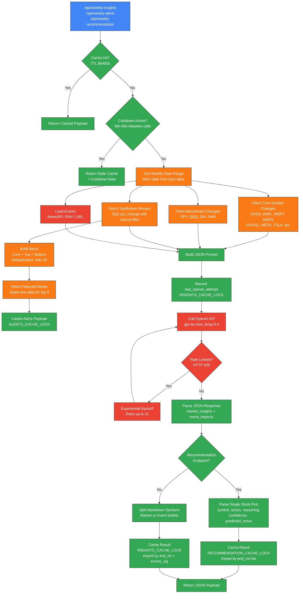

# Weekly Insights Pipeline

End-to-end flow for generating weekly market insights, alerts, and purchase recommendations. The pipeline gathers movers data from SQLite, fetches news headlines from NewsAPI, builds structured prompts, calls OpenAI with retry/rate-limit logic, and caches results behind thread locks with a 24-hour TTL.

## Key Components

- **Three Endpoints**: `/api/weekly-insights` (market bullets), `/api/weekly-alerts` (price alerts with spark-lines), `/api/weekly-recommendation` (single stock pick with risk preference: low/mid/high)
- **Movers Calculation** (`WeeklyMovers.py`): SQL query computes `pct_change` between start/end trading day close prices, with optional average volume filter (`DEFAULT_MIN_VOLUME = 2,000,000`), cached per `(direction, min_volume)` key
- **Events Loading** (`_load_events`): Tries three sources in order: `MARKET_EVENTS_JSON` env var, NewsAPI (`/v2/everything` with market query, up to 12 articles), or `MARKET_EVENTS_URL` fallback
- **OpenAI Call** (`_call_openai`): Uses `gpt-4o-mini` by default, temperature 0.4, max 500 tokens, system prompt as "concise market analyst", retries up to 2x with exponential backoff (1-8s), handles 429 with Retry-After header
- **Caching/Locking**: Three independent caches with `threading.Lock` -- `INSIGHTS_CACHE` (single dict, keyed by `end_int` + events signature), `ALERTS_CACHE` (keyed by `end_int:min_volume`), `RECOMMENDATION_CACHE` (keyed by `end_int:risk_strategy`), all with 24-hour TTL
- **Cooldown Mechanism**: 60s minimum between OpenAI calls (`OPENAI_MIN_INTERVAL_SECONDS`), 300s cooldown after rate-limit, 60s cooldown after other errors
- **Recommendation Extras**: Gathers XGBoost feature snapshots (`_get_feature_summaries`) for candidate stocks, includes risk preference description in prompt, returns structured JSON with symbol/action/reasoning/confidence

---
*Generated on 2026-03-26*
