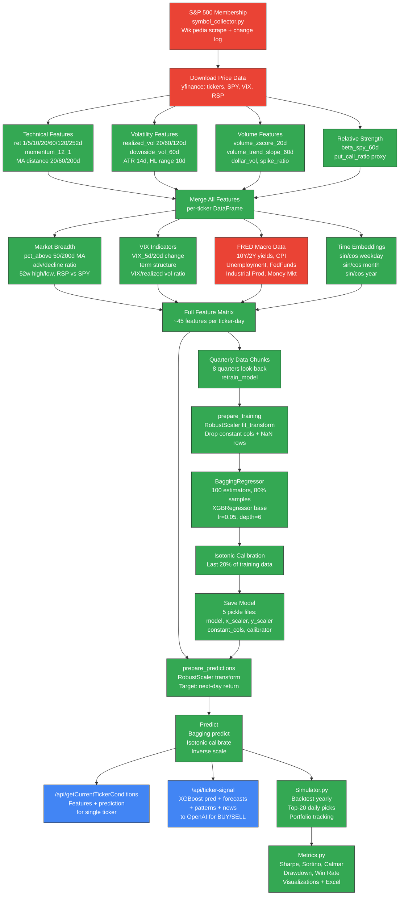

# XGBoost Investor Pipeline

End-to-end pipeline for the XGBoost-based stock return prediction system. Covers feature engineering from Yahoo Finance, FRED, and VIX data, model training with BaggingRegressor + XGBRegressor, isotonic calibration, and integration with the FastAPI endpoints for real-time ticker signals and conditions.

## Key Components

- **Symbol Collection** (`symbol_collector.py`): Reconstructs historical S&P 500 membership at any date by scraping Wikipedia's current list and unwinding the change log backward
- **Feature Engineering** (`Features.py`): Builds ~45 features per ticker-day across 6 categories -- momentum/returns (7 windows), volatility (6 indicators), volume (4 metrics), relative strength (beta, put/call), market breadth (5 cross-sectional), VIX (4 derivatives), FRED macroeconomic (7 series normalized 0-1), and cyclical time embeddings (6 sin/cos)
- **FRED Integration**: Fetches 7 economic indicators via FRED API (10Y/2Y Treasury yields, CPI, unemployment, Fed Funds rate, industrial production, retail money market funds), caches to CSV, forward-fills missing dates
- **Model Architecture** (`XGBoostInvestor.py`): `BaggingRegressor` wrapping 100 `XGBRegressor` estimators (learning_rate=0.05, max_depth=6, subsample=0.8), with `RobustScaler` for features and targets, plus `IsotonicRegression` calibration on the last 20% of training data
- **Training Pipeline**: Collects 8 quarterly chunks of historical data, each with its own S&P 500 membership; prepares data by removing constant columns and non-finite rows; persists 5 pickle files (model, x_scaler, y_scaler, constant_cols, calibrator)
- **Prediction Target**: Next-day forward return (`ret_1d` shifted by -1), predicting the percentage return one trading day ahead
- **API Integration**: Two endpoints consume predictions -- `/api/getCurrentTickerConditions` returns raw features + XGBoost prediction, `/api/ticker-signal` feeds the prediction along with forecasts, pattern matches, and news into OpenAI for a BUY/SELL signal
- **Backtesting** (`Simulator.py`): Runs year-by-year simulation selecting top-20 predicted stocks daily, tracks portfolio value; `Metrics.py` computes Sharpe, Sortino, Calmar ratios, drawdown, win rate, and exports to Excel + PNG charts

---
*Generated on 2026-03-26*
